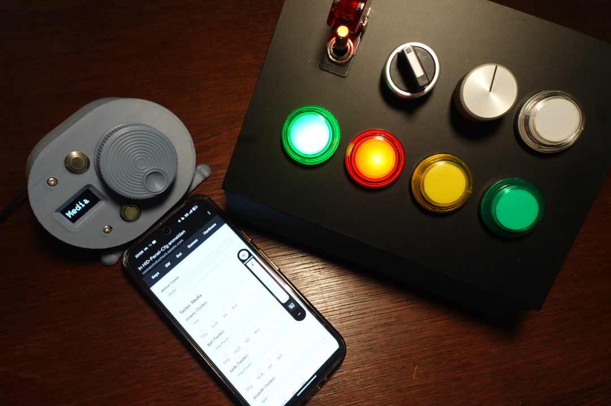
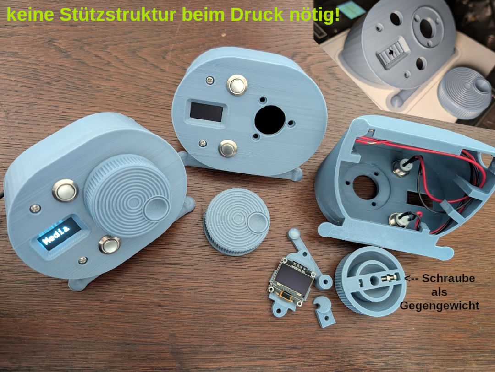
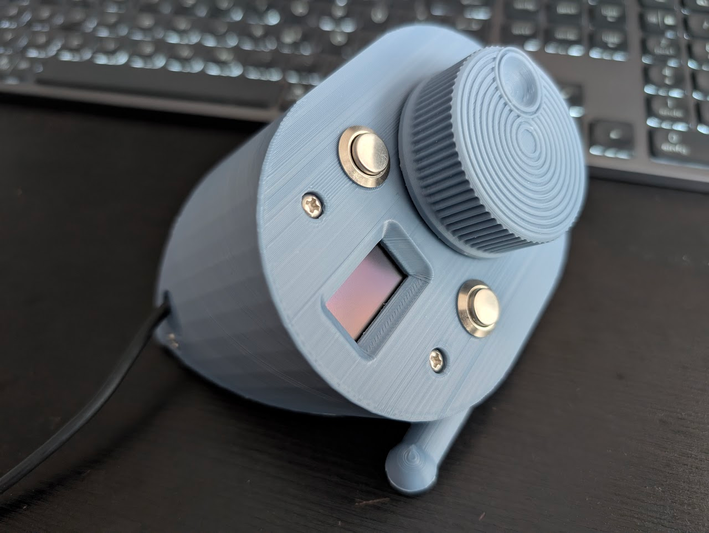

# HID-Panel

**Bluetooth-HID-Emulation with ESP32, configuration per WIFI-Portal**  
Since this project is also aimed at German-speaking youth work, the German language is used here. Please use your browser's translation function if you need this in English or another language ;)  

**Bluetooth-HID-Emulation mit ESP32, frei konfigurierbar per WIFI-Portal**  

Ziel dieses Projektes ist, mit einem ESP32 und ein paar Tasten, Schalter und Drehencoder einen Tastaturemulator zu bauen.  
Die Konfiguration erfolgt über ein Webinterface, das eine zusätzliche App überflüssig macht.  
Das Gerät meldet sich bei normalem Start als Bluetooth-Tastatur (mit Medientasten und Mausfunktion), die sich mit jedem Gerät koppeln lässt (Windows, Linux, MacOs, Android, iOS).  
**Der Code wurde mit wesentlicher Hilfe von Google Gemini erstellt.**   
(Natürlich ist das unschön, allerdings hat es mich so nur ein paar Urlaubstage und nicht mehrere Urlaubswochen gekostet. Wer einen ähnlichen Code handgeschrieben hinbekommt und mir ein Update schicken möchte, kann das natürlich gerne machen...)  

## Programmierung
Im Projekt liegt eine *.bin-Datei, die sich hiermit auf einen neuen ESP32-D1-Mini spielen lassen sollte:
https://web.esphome.io/ (Chromium/Edge/Vivaldi/Chrome-Browser benötigt)

Für die Installation per Arduino-IDE werden folgende Abhängigkeiten benötigt: 
- per Board Manager: Arduino ESP32-Boards (by Arduino)
- per Library Manager: ESPAsyncWebServer (by ESPAsync), Adafruit_SSD1306 (by Adafruit)
- liegt dem Projekt bei (unter src): eine auf aktuelle Arduino-Versionen angepasste HID-BLE Bibliothek von https://github.com/Kopunk/ESP32-BLE-Combo (DANKE!)

## Konfiguration
Die Konfiguration erfolgt über ein Webinterface, das beim Erststart automatisch gestartet wird. (SSID: HID-Panel-Cfg - PW: 12345678 )

Unter "Hardware" wird der Bluetooth-Name festgelegt. Diesen sollte man später nicht ändern (bzw. zuerst das Gerät entkoppeln, bevor man den Namen ändert).  
Ebenfalls werden dort die Anschlüsse eines Drehgebers, der Taster und Schalter festgelegt, ggf. auch mit den GPIOS für die passenden LEDs (z.B. bei Arcade-Buttons mit eingebauten LEDs).  
**ACHTUNG:**
- **Der erste konfigurierte Taster ist der Button, mit dem das WIFI-Interface gestartet wird (innerhalb der ersten 5 Sekunden nach Start/Reset).**  
- **Der zweite konfigurierte Taster wird zusammen mit dem ersten Taster gedrückt, um das Gerät neu zu starten.**  
Diese sollten also entsprechend zuerst eingestellt werden. Das heißt auch, dass mindestens zwei Taster erforderlich sind. 
- Es lassen sich bis zu 8 Taster konfigurieren, ggf. auch als Schalter.

- Ein Display ist optional. Es wird nur das SSD1306-OLED-Display unterstützt, Anschlüsse SDA->GPIO21; SCL->GPIO22 (Adresse 0x3C, also so wie bei diesen OLEDs üblich). Bei nicht vorhandenem Display wird dies einfach übersprungen. 

- Ein Drehgeber ist optional.  
  Unter "Hardware" wird eingestellt, auf welchen GPIOS A/CTRL und B/DTR angeschlossen werden (GND->GND; VCC->3.3V)  
  Empfohlene Einstellung bei mechanischen Drehgebern wie z.B. einem KY-040: 20 Schritte/U; 1 Schritte (Fein); 1000° Winkel/s (Fast)  
  Empfohlene Einstellung bei optischen Drehgebern wie z.B. einem 600P/R: 600 Schritte/U; 20 Schritte (Fein); 360° Winkel/s (Fast)  
  **WICHTIG BEI OPTISCHEN DREHGEBERN "5-24V":** VCC des Drehgebers auf 5V und unbedingt D1 auf ESP32 (neben USB-Anschluss) mit einem Draht überbrücken!  

- Unter "Szenen" lassen sich bis zu 5 verschiedene Layout-Szenarien festlegen (Beispiele: Media, Scroll, Game, Video, Funk)
  Die Umschaltung der Szenen lässt sich wie alle Kommandos auf beliebige Buttons und Schalter legen (ganz unten in der jeweiligen Auswahl). 

- Unter "Rot" wird pro Szene festgelegt, wie der Drehgeber sich verhält, bzw. welche Kommandos geschickt werden.
  Konfiguriert werden können die L- und R-Befehle bei normaler/langsamer Drehung und bei schneller Drehung.
  Beispiel: Bei langsamer Drehung könnte hier die Lautstärke, bei schneller Drehung der letzte oder nächste Titel gewählt werden.
  Beispiel 2: Bei Verwendung für eine Funksoftware könnten z.B. getrennte Tasten für 100Hz- und 10Hz-Schritte eingestellt werden.

- Unter "SW" werden pro Szene die Schalter konfiguriert.  
  Je Schalteränderung auf ein oder aus lassen sich unterschiedliche Tastenbefehle verknüpfen. Eignet sich z.B. auch für die Umschaltung von Szenen.  

- Unter "Keys" werden pro Szene die Taster konfiguriert.  
  Bei Verwendung eines Display empfielt es sich, eine Taste in allen Szenen so zu konfigurieren, dass diese zur jeweils nächsten Szene umschaltet.  

## 3D-Druck-Vorlage
Die im Projekt integrierten 3D-Vorlagen enthalten einmal den Drehknopf passend für einen 600P/R-Drehgeber und das Gehäuse mit allen Haltern.  
Das Gehäuse ist sowohl für ESP32-D1-Mini wie auch für den Raspi Pico geeignet. Der Ausschnitt ist für ein 0.96"-OLED-Display (SSD1306) vorbereitet.  
Das Gehäuse ist so entworfen worden, dass kein 3D-Druck mit Support nötig ist. Der Halter im Displayausschnitt lässt sich leicht entfernen.  
Die Teile werden mit M3-Schrauben und Muttern montiert. Schaut am besten in Eurem M3-Sortimentskasten, was für Euch am besten passt. Die Schrauben für die Montage des Drehgebers sollten allerdings möglichst kurz sein.  
**Dieses Gehäuse ist für das Projekt nicht unbedingt erforderlich!**
Es kann natürlich jedes beliebige Holzbrett, Holzkiste oder Blechgehäuse verwendet werden. 
Wer allerdings ein formschönes Gehäuse benötigt und einen 3D-Drucker hat, hat hier eine gute Vorlage. 

